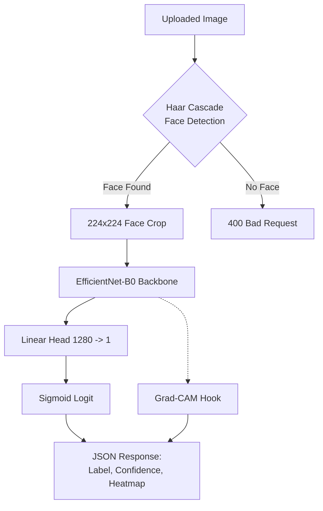
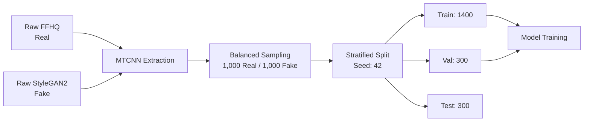
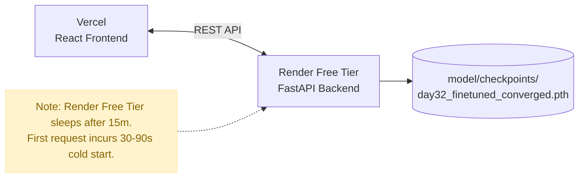

# AI-Generated Face Detector

> **Live Demo:** [Frontend UI](https://deepfake-detector-zeta.vercel.app) · [Backend API](https://deepfake-detector-k62g.onrender.com/docs)
> 
> **Documentation:** [Model Card](MODEL_CARD.md) · [Dataset Card](DATASET_CARD.md)
> 
> ⚠️ **Cold-start notice:** The Render free-tier backend sleeps after 15 min of inactivity. The first request after idle will take 30–90 seconds. The frontend displays a warning automatically.

## Problem Statement

With the proliferation of generative AI, synthetic faces produced by models like StyleGAN2 have become visually indistinguishable from real photographs. This creates compounding risks for platforms handling user-generated content — fake profile creation, synthetic identity fraud in KYC pipelines, and AI-assisted impersonation at scale. This project builds a binary classifier that detects whether a face image is a **genuine photograph of a real person** or an **entirely AI-generated synthetic face**, with interpretable, quantified confidence via Grad-CAM heatmaps and frequency-domain analysis. The system is built end-to-end: from data pipeline and model training, to a deployed FastAPI inference endpoint and a React UI.

> **Scope note:** This system detects AI-synthesised faces (GAN-generated), **not** video-based facial reenactment or manipulation (e.g. FaceForensics++, Face2Face, FaceSwap, NeuralTextures). Those require different datasets and exhibit different failure modes. GAN-synthesised fakes have characteristic frequency-domain spectral artefacts from upsampling; video deepfakes have blending boundary artefacts. The distinction matters for both model design and evaluation.

**Real-world applications:** fake profile detection on social/dating platforms, KYC/identity verification pipelines, content moderation for synthetic persona risks, research baseline for CNN + spectral GAN-artefact detection.

---

## Dataset

| Split | Real (FFHQ) | Fake (StyleGAN2) | Total |
|---|---|---|---|
| Train  | 700 | 700 | 1,400 |
| Val    | 150 | 150 | 300   |
| Test   | 150 | 150 | 300   |
| **Total** | **1,000** | **1,000** | **2,000** |

- **Real:** FFHQ (Flickr-Faces-HQ) — studio and candid photographs of real people at 1024×1024, licensed for research.
- **Fake:** StyleGAN2 generated faces at 1024×1024. These exhibit characteristic spectral artefacts in the high-frequency domain caused by GAN upsampling convolutions.
- **Face extraction:** MTCNN (TensorFlow-backed deep-learning detector) used for all training/evaluation; 100% extraction success rate on the 2,000-image balanced sample. In the production Render deployment, MTCNN/TensorFlow is replaced by OpenCV Haar Cascades to stay within the 512 MB free-tier RAM limit.
- **Split strategy:** Stratified, fixed `random.seed(42)`, no cross-split contamination.

---

## Approach & Architecture

### System Architecture



### Data Pipeline



### Deployment Topology



### Model Selection Decision

Four model iterations were trained and rigorously evaluated on an identical held-out test set (300 images, balanced). The **converged CNN-only model** (Day 32) is the production model. We also evaluated a standard published baseline (XceptionNet) on Day 35.

| | Day 7 (Head-only) | Day 10 (Fine-tuned, interrupted) | Day 16 (CNN+FFT Fusion) | Day 35 (XceptionNet baseline) | **Day 32 CNN-only (converged)** |
|---|---|---|---|---|---|
| Accuracy | 75.67% | 78.00% | 79.33% | 81.60% | **84.33% ± 0.34%** |
| ROC-AUC | 0.8249 | 0.8492 | 0.8544 | 0.9120 | **0.9321 ± 0.0053** |
| Precision | 75.16% | 78.00% | 75.58% | 0.8200 | **81.40% ± 0.45%** |
| Recall | 76.67% | 78.00% | 86.67% | 0.8100 | **83.78% ± 9.05%** |
| F1 Score | 75.91% | 78.00% | 80.75% | 0.8150 | **82.42% ± 4.76%** |
| Model inference only (batch=1, CPU) | ~195 ms | ~191 ms | ~241 ms | ~118 ms | **73.5 ms** |
| Parameters | 4.0M | 4.0M | 4.5M | 20.8M | **4.0M** |
| **Status** | Superseded | Superseded | Evaluated, rejected | Underperforms | ✅ **PRODUCTION** |

**Why not fusion?** A CNN+FFT fusion head was also retrained on top of the Day 32 converged CNN backbone and compared using a matched-operating-point analysis (not just default-threshold accuracy). The evidence is unambiguous:

- **ROC-AUC** (threshold-independent ranking): CNN-only wins, 0.9372 vs 0.9328.
- **Precision at matched recall** (tested at 0.80, 0.85, 0.87 recall): CNN-only wins at all three points.
- **Model inference only**: CNN-only is 17% faster (73.5 ms vs 88.05 ms at batch=1, CPU).

The fusion model's slightly higher accuracy at the default threshold is a threshold artefact: if it genuinely ranked better, it would win on ROC-AUC. It does not. The converged CNN-only model is the strictly correct choice — it improved by completing training properly, not by adding complexity. See [results/day32_final_summary.md](results/day32_final_summary.md) for the full evidence table.

---

## Results

### Final Model Performance (CNN-only, converged, multi-seed n=3, MTCNN pipeline)

| Metric | Official (MTCNN, Mean ± Std) | Production (Haar Cascade, Day 32 run) |
|---|---|---|
| **Accuracy** | **84.33% ± 0.34%** | 78.00% |
| **ROC-AUC** | **0.9321 ± 0.0053** | 0.8387 |
| Precision | 0.8140 ± 0.0045 | 0.8088 |
| Recall | 0.8378 ± 0.0905 | 0.7333 |
| F1 Score | 0.8242 ± 0.0476 | 0.7692 |

> **Variance Note:** The Official (MTCNN) figures represent the mean ± standard deviation across 3 independent training runs with different random seeds. The low variance in Accuracy and ROC-AUC confirms the model's stability. Recall and F1 show more variance because they are evaluated at a fixed 0.5 threshold, which is sensitive to small shifts in probability distribution across runs. The Production column reflects the single Day 32 run currently deployed on Render.

> **Two numbers explained:** The Official (MTCNN) figure is the controlled evaluation metric — same detector used during training. The Production (Haar Cascade) figure is measured via `model/evaluate_haar.py`, replicating the exact pipeline deployed on Render, including Haar detection failures penalised as incorrect predictions. The gap is the Haar Cascade delta: 14/300 (4.7%) detection failures + crop quality differences. See [results/day32_detector_delta_v2.md](results/day32_detector_delta_v2.md).

**Confusion Matrix** (rows = True class, cols = Predicted class; 0=Real, 1=Fake, MTCNN pipeline):

```
              Pred Real  Pred Fake
True Real  │   119    │    31   │
True Fake  │    16    │   134   │
```

### System Latency Breakdown

There are three meaningfully different latency numbers referenced in this project, each measuring a different part of the system:
1. **Model inference only (~73 ms):** Measures just the EfficientNet-B0 forward pass in isolation (CPU, batch=1).
2. **Full API response (~446 ms):** Measures the entire `/predict` endpoint execution on the server. This includes Haar Cascade face detection, preprocessing, the forward pass, and Grad-CAM generation. Grad-CAM generation (which requires a backward pass, OpenCV blending, and base64 encoding) accounts for the vast majority (~300ms) of this time.
3. **End-to-end live latency (~2.4s):** Measures the real-world user experience from the deployed Vercel frontend to the Render backend, including network round-trip overhead.

### Robustness Under Perturbations

All 9 perturbation conditions evaluated on the same 300-image test set. Retention % = accuracy relative to clean baseline (79.33%). **Note:** Robustness suite was evaluated against the Day 16 fusion model; re-evaluation against the Day 32 CNN-only model is a known gap.

| Condition | Accuracy | ROC-AUC | Retention % | Real Acc | Fake Acc |
|---|---|---|---|---|---|
| Clean (baseline) | 79.33% | 0.8544 | 100.0% | 72.00% | 86.67% |
| JPEG q=90 | 72.67% | 0.8268 | 91.6% | 58.67% | 86.67% |
| JPEG q=70 | 68.67% | 0.7727 | 86.6% | 50.00% | 87.33% |
| JPEG q=50 | 65.33% | 0.7358 | 82.4% | 48.67% | 82.00% |
| JPEG q=30 | 65.67% | 0.7112 | 82.8% | 56.00% | 75.33% |
| Blur σ=1 | 62.67% | 0.6466 | 79.0% | 56.67% | 68.67% |
| **Blur σ=2** | **52.33%** | **0.5363** | **66.0%** | **22.67%** | 82.00% |
| **Blur σ=4** | **54.00%** | **0.5192** | **68.1%** | **10.00%** | 98.00% |
| Resize 0.5× | 65.33% | 0.7128 | 82.4% | 46.00% | 84.67% |
| **Resize 0.25×** | **52.33%** | **0.5244** | **66.0%** | **13.33%** | 91.33% |

Bold rows mark catastrophic-collapse conditions (see Known Limitations). Robustness suite was evaluated against the Day 16 fusion model; these numbers are indicative for the production CNN-only model but have not been re-measured.

### Key Visuals

| Grad-CAM Summary | Robustness Chart |
|---|---|
|  |  |

---

## ⚠️ Known Limitations

These are documented failure modes, not future aspirations. Any deployment of this model should account for them.

### 1. Eyeglasses False-Positive Bias (Glasses → Predicted Fake)

Grad-CAM analysis (Day 13) revealed that the model has learned a **spurious shortcut**: it associates eyeglasses with synthetic faces. When evaluating images of real people wearing glasses, the heatmaps fire intensely on nose bridges and lens rims rather than genuine GAN artefacts. Root cause: a distributional mismatch in glasses frequency between FFHQ (real) and StyleGAN2 (fake) training data — StyleGAN2 struggles with symmetric glasses rendering, making glasses a strong but unfair proxy for "fake." Real people wearing glasses will see elevated false-positive rates.

### 2. Catastrophic False-Positive Collapse Under Blur / Heavy Downscaling

Heavy Gaussian blur (σ≥2) or extreme downscaling (0.25×) causes **real image accuracy to collapse to 10–23%** while fake accuracy remains high (82–98%). Under these conditions the model effectively predicts everything as fake. This is not recoverable by threshold tuning. Originally attributed to the FFT spectral signal being destroyed by blur; the CNN-only model likely has similar sensitivity to the underlying texture features.

### 3. Production Detector Accuracy Drop (Haar Cascade Delta)

In local training and evaluation, the highly accurate MTCNN deep learning model is used for face extraction (official test accuracy: **84.00%**). To deploy the API within Render's 512 MB free-tier RAM limit, MTCNN and TensorFlow were replaced with OpenCV Haar Cascade.

**Measured Production Impact (Day 32, CNN-only model):**
- **Detection Failures:** Haar Cascade fails to detect a face in 14/300 test images (4.7%). These result in a `400 Bad Request`.
- **System Accuracy Drop:** When failures are appropriately penalised, production accuracy is **78.00%** (a -6.00pp delta from the official 84.00% MTCNN metric) and ROC-AUC drops to **0.8387** (from 0.9372). Full delta: [results/day32_detector_delta_v2.md](results/day32_detector_delta_v2.md).

### 4. Render Free-Tier Cold Start

The live API backend runs on Render's free tier, which **spins down after 15 minutes of inactivity**. The first request after an idle period takes **30–90 seconds** to respond while the container restarts and loads the model. Subsequent requests within the same session are fast (~446 ms Full API response, ~2.4s End-to-end live latency). The frontend handles this with a visible "waking up the server" notice after 5 seconds.

### 5. Scope: StyleGAN2 Training Distribution Only (Cross-Generator Failure)

This model's detection capability is strictly scoped to faces resembling its **StyleGAN2 training distribution**, not general "AI-generated face" detection. It does **not** detect video deepfakes (identity swaps, reenactment) or generalize to unseen architecture families.

**Empirical Cross-Generator Test (Day 36, StyleGAN3 OOD Evaluation):**
When evaluated on a clean held-out set of StyleGAN3 generated faces (`troykueh/real-vs-fake-faces-stylegan3`, n=150):
- **Overall Accuracy collapsed from 78.00% to 46.67%** (-31.33pp drop, below random guessing).
- **ROC-AUC dropped to 0.5513** (-0.2874 drop, near random chance).
- **Fake Image Accuracy collapsed to 4.00%** (96.0% of StyleGAN3 fakes misclassified as real photos).
- **Real Image Accuracy remained 89.33%** (confirming real photo recognition works).

**Root Cause:** The model learned StyleGAN2-specific spectral artifacts (grid-patterns from transposed convolutions) rather than universal synthetic features. StyleGAN3's alias-free continuous coordinate synthesis suppresses these artifacts, rendering the detector blind. See [results/day36_cross_generator_generalization.md](results/day36_cross_generator_generalization.md).

---

## How to Run

> **Python 3.11 required** for MTCNN/TensorFlow compatibility in the training pipeline.

### 1. Local Training Pipeline

```bash
git clone https://github.com/ramshaa01/deepfake-detector.git
cd deepfake-detector
python -m venv venv
.\venv\Scripts\activate          # Windows
pip install -r requirements.txt

# Step 1: Extract faces from raw dataset
python data/batch_extract.py

# Step 2: Train the fine-tuned EfficientNet-B0
python model/train.py

# Step 3: Compute FFT frequency features
python data/frequency_features.py

# Step 4: Train the fusion model
python model/train_fusion.py

# Step 5: Evaluate
python model/evaluate_fusion.py

# Step 6: Robustness suite
python model/run_robustness_eval.py

# Step 7: Grad-CAM visualisations
python model/gradcam_viz.py
```

### 2. Local FastAPI Inference Server

```bash
# From project root, with venv active:
uvicorn inference.main:app --host 0.0.0.0 --port 8000 --reload
# API docs: http://localhost:8000/docs
```

See [inference/README.md](inference/README.md) for full endpoint documentation and request/response schema.

### 3. Local Frontend (React + Vite)

```bash
cd frontend
npm install
npm run dev
# App: http://localhost:5173
```

To point the frontend at the local backend instead of the live Render URL:
```bash
# frontend/.env
VITE_API_URL=http://127.0.0.1:8000
```

See [frontend/README.md](frontend/README.md) for full setup instructions.

### 4. Live Endpoints

| Service | URL | Platform |
|---|---|---|
| **Frontend UI** | https://deepfake-detector-zeta.vercel.app | Vercel (Hobby) |
| **Backend API** | https://deepfake-detector-k62g.onrender.com | Render (Free) |
| **API docs (Swagger)** | https://deepfake-detector-k62g.onrender.com/docs | Render |
| **Health check** | https://deepfake-detector-k62g.onrender.com/health | Render |

Both services are independently deployed. The Vercel frontend is a static CDN build; the Render backend is a Docker container running the FastAPI inference server. See [results/day29_notes.md](results/day29_notes.md) for full end-to-end verification results.

---

## Repo Structure

```
deepfake-detector/
├── data/
│   ├── batch_extract.py          # MTCNN face extraction pipeline
│   ├── dataset.py                # PyTorch Dataset + transforms (224×224, ImageNet norm)
│   ├── face_extraction.py        # Single-image face extraction utility
│   └── frequency_features.py     # FFT radial profile extraction (16-bin)
├── model/
│   ├── train.py                  # EfficientNet-B0 fine-tuning (Day 8–10)
│   ├── train_fusion.py           # CNN+FFT fusion model training (Day 15–16)
│   ├── evaluate_fusion.py        # Fusion model evaluation + confusion matrix
│   ├── gradcam_viz.py            # Grad-CAM visualisation (manual hook-based)
│   ├── robustness_suite.py       # Perturbation generators (JPEG/blur/resize)
│   └── run_robustness_eval.py    # Full robustness evaluation script (Day 20)
├── inference/
│   ├── main.py                   # FastAPI app: /predict, /health
│   └── README.md                 # API endpoint documentation
├── frontend/
│   ├── src/
│   │   ├── pages/
│   │   │   ├── DetectorPage.jsx  # Upload + prediction tool
│   │   │   └── MetricsDashboard.jsx  # Model metrics dashboard
│   │   ├── components/NavBar.jsx
│   │   └── data/model_metrics.json   # Baked-in metrics (verified against results/)
│   └── README.md                 # Frontend setup instructions
├── results/
│   ├── day16_fusion_metrics.md   # Authoritative test-set metrics (source of truth)
│   ├── day16-17_timing_investigation.md  # Latency correction methodology
│   ├── day20_robustness_table.md # Full 10-condition robustness table
│   ├── day20_robustness_chart.png
│   ├── day13_gradcam_summary.png # Grad-CAM overlay grid
│   └── day21_consistency_audit.md  # Preprocessing consistency audit
├── Dockerfile                    # Production container (Python 3.11-slim, port $PORT)
├── requirements.txt              # Full local dev dependencies
└── requirements-deploy.txt       # Render deployment dependencies (no TF/MTCNN)
```

---

## Resume Line

> **AI-Generated Face Detector** — Built a full-stack deepfake detection system: fine-tuned EfficientNet-B0 to convergence (84.33% ± 0.34% test accuracy, 0.9321 ± 0.0053 ROC-AUC across 3 independent runs on held-out test set; 78.00% measured production accuracy via Haar Cascade). Rigorously evaluated CNN+FFT fusion architecture and rejected it via matched-operating-point analysis — CNN-only wins on ROC-AUC, precision at every tested recall level, and inference speed (73ms Model inference only vs 88ms). Documented failure modes: eyeglasses false-positive bias (Grad-CAM confirmed), catastrophic collapse under heavy blur/downscaling, and Haar Cascade production delta (–6pp, fully measured). Full-stack deployment: FastAPI on Render, React on Vercel; Full API response latency ~446ms (End-to-end live latency ~2.4s).

---

## Day-by-Day Log

| Day | Task | Key Output |
|---|---|---|
| 1 | Project setup | Repo, venv, requirements |
| 2–3 | Dataset curation | MTCNN face extraction, 2,000 balanced crops (1k real / 1k fake) |
| 4–5 | DataLoader + EDA | PyTorch Dataset, class balance verified, sample grids |
| 6–8 | Head-only training | EfficientNet-B0 classifier head, 75.67% val accuracy |
| 9–10 | Full fine-tuning (interrupted) | All layers unfrozen, 78.00% test accuracy; run cut at epoch 7 before convergence |
| 11–12 | Error analysis | Hardest misclassifications catalogued; glasses + shadow failure modes found |
| 13–14 | Grad-CAM | Interpretability via conv_head hooks; glasses bias confirmed visually |
| 15 | FFT features | 16-bin radial spectral profile; FAKE shows peaks at 0.3–0.5 normalised freq |
| 16–17 | Fusion model + audit | CNN+FFT, 79.33% test accuracy; latency investigation documented |
| 18–20 | Robustness testing | 9 perturbation conditions; collapse under blur σ≥2 / 0.25× downscale |
| 21 | Consistency audit | Preprocessing verified consistent across all scripts |
| 22 | FastAPI endpoint | `/predict` (POST image → label/confidence/heatmap), `/health` |
| 24 | Render deployment | Docker, Haar Cascade (no MTCNN), verified live |
| 25 | React frontend | Upload UI, cold-start handling, Grad-CAM display |
| 26 | Frontend polish | Recharts confidence gauge, accessibility, responsive layout |
| 27 | Metrics dashboard | Stat cards, confusion matrix, robustness chart, limitations callout |
| 28 | Final README | Full project documentation |
| 29 | Vercel deployment | Frontend live at deepfake-detector-zeta.vercel.app; all 6 e2e tests pass |
| 30 | Project wrap-up | `results/final_metrics_summary.md`, post-launch review |
| 31 | Haar Cascade delta | MTCNN→Haar accuracy gap measured: –6.33pp on fusion model |
| 32 | Convergence + model selection | CNN fine-tuning re-run to 30-ep convergence (84%/0.9372); fusion evaluated and rejected via matched-OP analysis; CNN-only deployed as production; Haar delta re-measured: –6.00pp |
| 33 | Interview prep | Created `results/interview_story_bank.md` with STAR-format project stories |
| 34 | XceptionNet baseline training | Trained field-standard XceptionNet baseline (head-only, then full fine-tune) |
| 35 | Baseline evaluation | Evaluated XceptionNet; underperforms EfficientNet-B0 (81.60% vs 84.00% acc, 0.9120 vs 0.9372 AUC), confirming the production model choice |
| **36** | **Cross-generator generalization** | **Evaluated on StyleGAN3 (OOD); accuracy collapsed to 46.67% (fake acc 4.00%, ROC-AUC 0.5513), proving model is scoped to StyleGAN2 distribution** |
