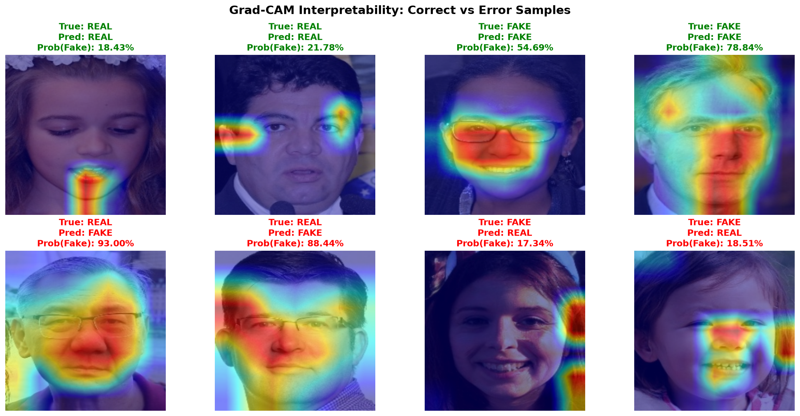
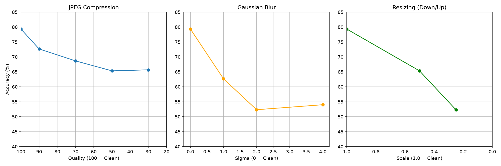

# AI-Generated Face Detector

> **Live Demo:** [Backend API](https://deepfake-detector-k62g.onrender.com/docs) · [Frontend](#) *(Day 29 deployment pending)*

## Problem Statement

With the proliferation of generative AI, synthetic faces produced by models like StyleGAN2 have become visually indistinguishable from real photographs. This creates compounding risks for platforms handling user-generated content — fake profile creation, synthetic identity fraud in KYC pipelines, and AI-assisted impersonation at scale. This project builds a binary classifier that detects whether a face image is a **genuine photograph of a real person** or an **entirely AI-generated synthetic face**, with interpretable, quantified confidence via Grad-CAM heatmaps and frequency-domain analysis. The system is built end-to-end: from data pipeline and model training, to a deployed FastAPI inference endpoint and a React UI.

> **Scope note:** This system detects AI-synthesised faces (GAN-generated), **not** video-based facial reenactment or manipulation (e.g. FaceForensics++, Face2Face, FaceSwap, NeuralTextures). Those require different datasets and exhibit different failure modes. GAN-synthesised fakes have characteristic frequency-domain spectral artefacts from upsampling; video deepfakes have blending boundary artefacts. The distinction matters for both model design and evaluation.

**Real-world applications:** fake profile detection on social/dating platforms, KYC/identity verification pipelines, content moderation for synthetic persona risks, research baseline for CNN + spectral GAN-artefact detection.

---

## Dataset

| Split | Real (FFHQ) | Fake (StyleGAN2) | Total |
|---|---|---|---|
| Train  | 700 | 700 | 1,400 |
| Val    | 150 | 150 | 300   |
| Test   | 150 | 150 | 300   |
| **Total** | **1,000** | **1,000** | **2,000** |

- **Real:** FFHQ (Flickr-Faces-HQ) — studio and candid photographs of real people at 1024×1024, licensed for research.
- **Fake:** StyleGAN2 generated faces at 1024×1024. These exhibit characteristic spectral artefacts in the high-frequency domain caused by GAN upsampling convolutions.
- **Face extraction:** MTCNN (TensorFlow-backed deep-learning detector) used for all training/evaluation; 100% extraction success rate on the 2,000-image balanced sample. In the production Render deployment, MTCNN/TensorFlow is replaced by OpenCV Haar Cascades to stay within the 512 MB free-tier RAM limit.
- **Split strategy:** Stratified, fixed `random.seed(42)`, no cross-split contamination.

---

## Approach & Architecture

```
Uploaded Image
      │
      ▼
Face Extraction (MTCNN training / Haar Cascade production)
      │ 224×224 face crop
      ┌─────────────┴──────────────────┐
      ▼                                ▼
EfficientNet-B0 (ImageNet pre-trained) │  FFT Radial Profile Extractor
  → fine-tuned on face crops           │  → 16-bin radial spectrum
  → 1280-dim embedding                 │  → z-score normalised (16-dim)
      │                                │
      └──────────────┬─────────────────┘
                     ▼
              Fusion MLP (1296 → 256 → 1)
                     │
                  Sigmoid logit → "real" / "fake"
                     │
              Grad-CAM heatmap (manual hook-based, conv_head layer)
```

### Model Selection Decision

Three model iterations were evaluated on an identical held-out test set (300 images, balanced). The fusion model (CNN + FFT) was selected as the production model because it achieves the highest accuracy and ranking metrics, despite a latency cost:

| | Day 7 (Head-only CNN) | Day 10 (Fine-tuned CNN) | Day 16 (CNN + FFT Fusion) |
|---|---|---|---|
| Accuracy | 75.67% | 78.00% | **79.33%** |
| ROC-AUC  | 0.8249 | 0.8492 | **0.8544** |
| Precision | 75.16% | 78.00% | 75.58% |
| Recall   | 76.67% | 78.00% | **86.67%** |
| F1 Score | 75.91% | 78.00% | **80.75%** |
| Latency (batch=1, CPU) | 195.31 ms | 191.17 ms | 241.24 ms (+26%) |

> **Latency note:** The fusion model's single-image latency of ~241 ms was independently benchmarked under standardised deployment conditions (single-image batch, on-the-fly FFT extraction from disk). The ~53 ms figure in `day16_fusion_metrics.md` reflects batch-evaluation throughput (batch=32, pre-computed FFT from `.npz`) and is not representative of API deployment latency. See [results/day16-17_timing_investigation.md](results/day16-17_timing_investigation.md) for full methodology.

The recall lift (+8.67% over the CNN-only at default threshold) is partially a threshold artefact — when the CNN-only threshold is tuned to match the fusion model's 86.67% recall, it achieves 73.03% precision vs. the fusion's 75.58% (+2.55pp advantage). The fusion model also shows a modest but consistent ROC-AUC and PR-AUC improvement. For a safety-sensitive application where false negatives (real faces missed as synthetic) are more costly than false positives, the high-recall profile of the fusion model is the appropriate choice.

---

## Results

### Final Model Performance (Fusion, held-out test set, n=300)

| Metric | Value |
|---|---|
| **Accuracy** | **79.33%** |
| **ROC-AUC** | **0.8544** |
| Precision | 0.7558 |
| Recall | 0.8667 |
| F1 Score | 0.8075 |

**Confusion Matrix** (rows = True class, cols = Predicted class; 0=Real, 1=Fake):

```
              Pred Real  Pred Fake
True Real  │   108    │    42   │
True Fake  │    20    │   130   │
```

- True Real (correct): 108 · False Fake (FN): 42 · False Real (FP): 20 · True Fake (correct): 130

### Robustness Under Perturbations

All 9 perturbation conditions evaluated on the same 300-image test set. Retention % = accuracy relative to clean baseline (79.33%).

| Condition | Accuracy | ROC-AUC | Retention % | Real Acc | Fake Acc |
|---|---|---|---|---|---|
| Clean (baseline) | 79.33% | 0.8544 | 100.0% | 72.00% | 86.67% |
| JPEG q=90 | 72.67% | 0.8268 | 91.6% | 58.67% | 86.67% |
| JPEG q=70 | 68.67% | 0.7727 | 86.6% | 50.00% | 87.33% |
| JPEG q=50 | 65.33% | 0.7358 | 82.4% | 48.67% | 82.00% |
| JPEG q=30 | 65.67% | 0.7112 | 82.8% | 56.00% | 75.33% |
| Blur σ=1 | 62.67% | 0.6466 | 79.0% | 56.67% | 68.67% |
| **Blur σ=2** | **52.33%** | **0.5363** | **66.0%** | **22.67%** | 82.00% |
| **Blur σ=4** | **54.00%** | **0.5192** | **68.1%** | **10.00%** | 98.00% |
| Resize 0.5× | 65.33% | 0.7128 | 82.4% | 46.00% | 84.67% |
| **Resize 0.25×** | **52.33%** | **0.5244** | **66.0%** | **13.33%** | 91.33% |

Bold rows mark catastrophic-collapse conditions (see Known Limitations).

### Key Visuals

| Grad-CAM Summary | Robustness Chart |
|---|---|
|  |  |

---

## ⚠️ Known Limitations

These are documented failure modes, not future aspirations. Any deployment of this model should account for them.

### 1. Eyeglasses False-Positive Bias (Glasses → Predicted Fake)

Grad-CAM analysis (Day 13) revealed that the model has learned a **spurious shortcut**: it associates eyeglasses with synthetic faces. When evaluating images of real people wearing glasses, the heatmaps fire intensely on nose bridges and lens rims rather than genuine GAN artefacts. Root cause: a distributional mismatch in glasses frequency between FFHQ (real) and StyleGAN2 (fake) training data — StyleGAN2 struggles with symmetric glasses rendering, making glasses a strong but unfair proxy for "fake." Real people wearing glasses will see elevated false-positive rates.

### 2. Catastrophic False-Positive Collapse Under Blur / Heavy Downscaling

The fusion model relies on high-frequency spectral artefacts introduced by GAN upsampling. Heavy Gaussian blur (σ≥2) or extreme downscaling (0.25×) destroys those artefacts, causing **real image accuracy to collapse to 10–23%** while fake accuracy remains high (82–98%). Under these conditions the model effectively predicts everything as fake. This is not recoverable by threshold tuning — the spectral signal the model learned simply does not survive the degradation.

### 3. Render Free-Tier Cold Start

The live API backend runs on Render's free tier, which **spins down after 15 minutes of inactivity**. The first request after an idle period takes **30–90 seconds** to respond while the container restarts and loads the model. Subsequent requests within the same session are fast (~240–400 ms end-to-end). The frontend handles this with a visible "waking up the server" notice after 5 seconds.

### 4. Scope: Synthesised Faces Only

This model does not detect video deepfakes (identity-swap manipulations, face reenactment). It was trained and evaluated on GAN-synthesised full face images only. Attempting to use it on video deepfakes, partial face manipulations, or other generator architectures (Stable Diffusion, DALL·E) will yield unreliable results.

---

## How to Run

> **Python 3.11 required** for MTCNN/TensorFlow compatibility in the training pipeline.

### 1. Local Training Pipeline

```bash
git clone https://github.com/ramshaa01/deepfake-detector.git
cd deepfake-detector
python -m venv venv
.\venv\Scripts\activate          # Windows
pip install -r requirements.txt

# Step 1: Extract faces from raw dataset
python data/batch_extract.py

# Step 2: Train the fine-tuned EfficientNet-B0
python model/train.py

# Step 3: Compute FFT frequency features
python data/frequency_features.py

# Step 4: Train the fusion model
python model/train_fusion.py

# Step 5: Evaluate
python model/evaluate_fusion.py

# Step 6: Robustness suite
python model/run_robustness_eval.py

# Step 7: Grad-CAM visualisations
python model/gradcam_viz.py
```

### 2. Local FastAPI Inference Server

```bash
# From project root, with venv active:
uvicorn inference.main:app --host 0.0.0.0 --port 8000 --reload
# API docs: http://localhost:8000/docs
```

See [inference/README.md](inference/README.md) for full endpoint documentation and request/response schema.

### 3. Local Frontend (React + Vite)

```bash
cd frontend
npm install
npm run dev
# App: http://localhost:5173
```

To point the frontend at the local backend instead of the live Render URL:
```bash
# frontend/.env
VITE_API_URL=http://127.0.0.1:8000
```

See [frontend/README.md](frontend/README.md) for full setup instructions.

### 4. Live Endpoints

| Service | URL |
|---|---|
| **Backend API** | https://deepfake-detector-k62g.onrender.com |
| **API docs (Swagger)** | https://deepfake-detector-k62g.onrender.com/docs |
| **Health check** | https://deepfake-detector-k62g.onrender.com/health |
| **Frontend** | *(Day 29 — Vercel deployment pending)* |

---

## Repo Structure

```
deepfake-detector/
├── data/
│   ├── batch_extract.py          # MTCNN face extraction pipeline
│   ├── dataset.py                # PyTorch Dataset + transforms (224×224, ImageNet norm)
│   ├── face_extraction.py        # Single-image face extraction utility
│   └── frequency_features.py     # FFT radial profile extraction (16-bin)
├── model/
│   ├── train.py                  # EfficientNet-B0 fine-tuning (Day 8–10)
│   ├── train_fusion.py           # CNN+FFT fusion model training (Day 15–16)
│   ├── evaluate_fusion.py        # Fusion model evaluation + confusion matrix
│   ├── gradcam_viz.py            # Grad-CAM visualisation (manual hook-based)
│   ├── robustness_suite.py       # Perturbation generators (JPEG/blur/resize)
│   └── run_robustness_eval.py    # Full robustness evaluation script (Day 20)
├── inference/
│   ├── main.py                   # FastAPI app: /predict, /health
│   └── README.md                 # API endpoint documentation
├── frontend/
│   ├── src/
│   │   ├── pages/
│   │   │   ├── DetectorPage.jsx  # Upload + prediction tool
│   │   │   └── MetricsDashboard.jsx  # Model metrics dashboard
│   │   ├── components/NavBar.jsx
│   │   └── data/model_metrics.json   # Baked-in metrics (verified against results/)
│   └── README.md                 # Frontend setup instructions
├── results/
│   ├── day16_fusion_metrics.md   # Authoritative test-set metrics (source of truth)
│   ├── day16-17_timing_investigation.md  # Latency correction methodology
│   ├── day20_robustness_table.md # Full 10-condition robustness table
│   ├── day20_robustness_chart.png
│   ├── day13_gradcam_summary.png # Grad-CAM overlay grid
│   └── day21_consistency_audit.md  # Preprocessing consistency audit
├── Dockerfile                    # Production container (Python 3.11-slim, port $PORT)
├── requirements.txt              # Full local dev dependencies
└── requirements-deploy.txt       # Render deployment dependencies (no TF/MTCNN)
```

---

## Resume Line

> **AI-Generated Face Detector** — Built a full-stack deepfake detection system: fine-tuned EfficientNet-B0 fused with FFT frequency features (79.33% test accuracy, 0.8544 ROC-AUC, 86.67% recall on held-out test set of 300 balanced faces). Documented known failure modes: eyeglasses false-positive bias (confirmed via Grad-CAM), and catastrophic accuracy collapse under heavy blur/downscaling (Real accuracy drops to 10% at σ=4). Deployed via FastAPI on Render with React frontend; real-world single-image CPU latency ~241 ms.

---

## Day-by-Day Log

| Day | Task | Key Output |
|---|---|---|
| 1 | Project setup | Repo, venv, requirements |
| 2–3 | Dataset curation | MTCNN face extraction, 2,000 balanced crops (1k real / 1k fake) |
| 4–5 | DataLoader + EDA | PyTorch Dataset, class balance verified, sample grids |
| 6–8 | Head-only training | EfficientNet-B0 classifier head, 75.67% val accuracy |
| 9–10 | Full fine-tuning | All layers unfrozen, 78.00% test accuracy, ROC-AUC 0.8492 |
| 11–12 | Error analysis | Hardest misclassifications catalogued; glasses + shadow failure modes found |
| 13–14 | Grad-CAM | Interpretability via conv_head hooks; glasses bias confirmed visually |
| 15 | FFT features | 16-bin radial spectral profile; FAKE shows peaks at 0.3–0.5 normalised freq |
| 16–17 | Fusion model + audit | CNN+FFT, 79.33% test accuracy; latency investigation documented |
| 18–20 | Robustness testing | 9 perturbation conditions; collapse under blur σ≥2 / 0.25× downscale |
| 21 | Consistency audit | Preprocessing verified consistent across all scripts |
| 22 | FastAPI endpoint | `/predict` (POST image → label/confidence/heatmap), `/health` |
| 24 | Render deployment | Docker, Haar Cascade (no MTCNN), verified live |
| 25 | React frontend | Upload UI, cold-start handling, Grad-CAM display |
| 26 | Frontend polish | Recharts confidence gauge, accessibility, responsive layout |
| 27 | Metrics dashboard | Stat cards, confusion matrix, robustness chart, limitations callout |
| 28 | Final README | This document |
| 29 | Vercel deployment | *(pending)* |
