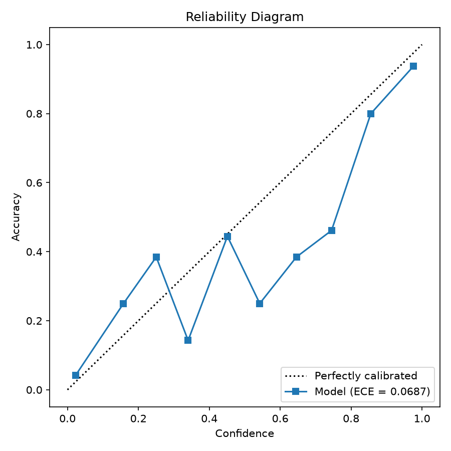

# Day 39: Confidence Calibration Analysis

**Expected Calibration Error (ECE):** 0.0687

### Interpretation
The model is reasonably well-calibrated (ECE < 0.10). Its confidence scores generally reflect true probabilities, with minor deviations. It can be safely used for thresholding with standard caution.

### Reliability Diagram

